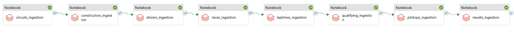

# 🏎️ F1 Analytics on Azure Databricks
## 🚀 Project Overview
This project builds a data analysis system for Formula 1 race results using Azure services. You’ll implement a modern ETL pipeline to ingest, transform, and analyze F1 data, harvesting insights on drivers and constructors.

## 📊 Data Flow & Architecture
Source: F1 data from Ergast Developer API, covering 1950–present. Includes circuits, races, drivers, constructors, results, pit stops, lap times, and qualifying data.

Ingestion (Bronze Zone)

Azure Data Factory orchestrates ingestion.

Raw JSON/CSV files landed in Azure Data Lake Storage Gen2.

Transform to Silver

Databricks notebooks:

Schema enforcement

Cleaning, renaming, audit columns (ingestion_date, file_source, file_date)

Convert to Delta format (via upserts).

Data moved to Silver zone via ADF.

Transform to Gold

Further transformation via Databricks SQL notebooks:

Joins, aggregations, driver standings, constructor standings

Designed for BI-ready tables (optimized for analysis)

Output written to Gold zone.

Scheduling & Orchestration

Pipelines scheduled weekly (e.g., Sundays at 10 PM)

Full monitoring with alerts and retry mechanisms.

## 🛠️ Technologies & Tools
Azure Data Lake Storage Gen2 – scalable Delta storage

Azure Data Factory – pipeline orchestration + scheduling

Azure Databricks – PySpark & Spark SQL notebooks

Delta Lake – ACID tables, versioning, incremental loads

Azure Key Vault – secret management

Power BI – visualization & dashboarding

Additional Tools:

Databricks magic commands & utilities

Temporary/global views, clusters & job orchestration

## 📁 Repository Structure

```
├── setup/             # Mount Azure storage, initialize environments
├── ingestion/         # Bronze → Silver notebooks
├── transformation/    # Silver → Gold notebooks
├── analysis/          # SQL scripts for standings, dominance, insights
├── notebooks/         # Helper notebooks for utilities, views
└── pipelines/         # ADF pipeline definitions & triggers
```
